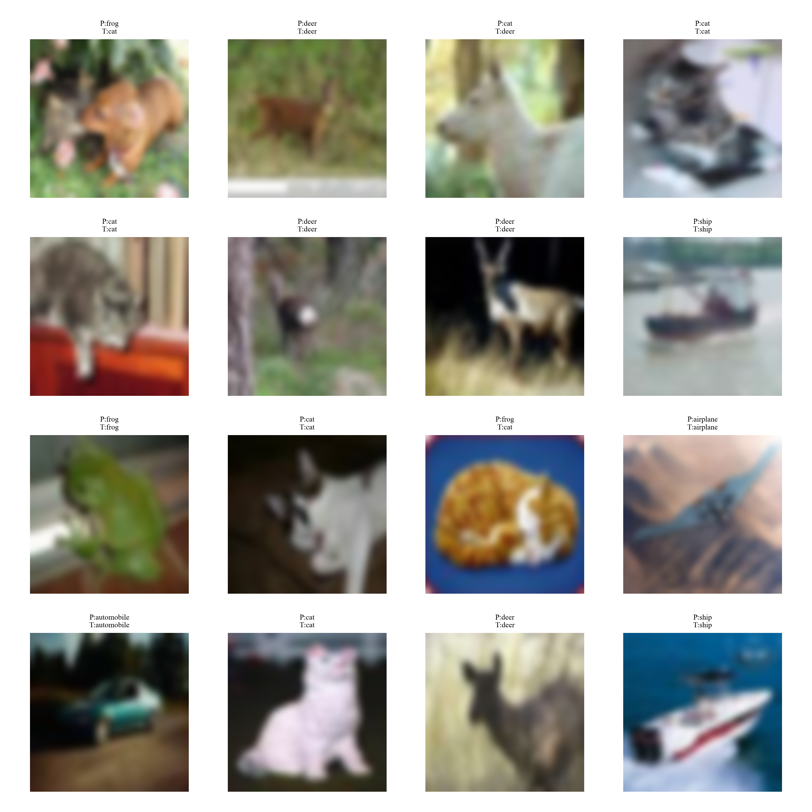
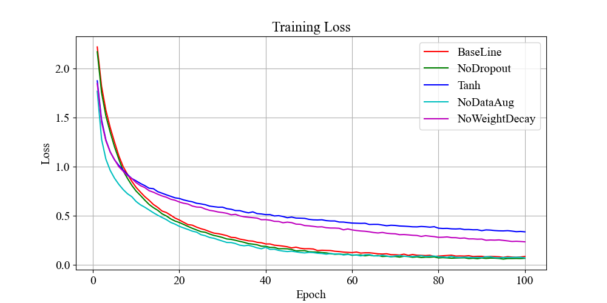
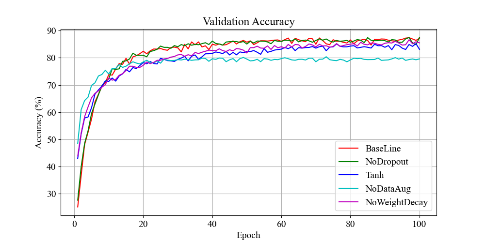

# 1. AlexNet 论文梳理

《ImageNet Classification with Deep Convolutional Neural Networks》 作者：Alex Krizhevsky 等人，发表于：NIPS 2012

## 1.1 数据集ImageNet LSVRC 2010/2012

* 超大规模数据集
* 约 120 万训练图像
* 1000 类分类任务
* RGB 彩色图像

这是第一次深层 CNN 在超大数据集上取得巨大成功，之前 CNN 主要还是 MNIST 小数据集

## 1.2 网络结构

```text
CNN → Pool
CNN → Pool
CNN
CNN
CNN → Pool
FC、FC、FC
```

---

## 1.3 重要创新

### 1.3.1 ReLU 激活函数

Sigmoid / Tanh 梯度消失、收敛慢；ReLU 训练速度大幅提升，深层网络首次真正可训练。

$
ReLU(x)=max(0,x)
$

### 1.3.2 GPU 训练

双 GPU 并行训练，显著加速训练过程。

### 1.3.3 局部响应归一化（LRN）

论文里用了Local Response Normalization，增强局部竞争。BatchNorm 出现后基本淘汰，而且在 VGG 里证明此方法效果不大。

### 1.3.4 重叠池化（Overlapping Pooling）

以前池化窗与步长相等 kernel=stride=2，文章里使用 kernel=3 stride=2，池化区域重叠，以此保留更多信息。

### 1.3.5 减少过拟合

（1）数据增强

* 平移
* 翻转
* 随机裁剪
* PCA颜色扰动

（2）Dropout最大工程创新之一

训练时随机丢弃神经元，防止神经元过度依赖。

## 1.4 评价指标

核心含义：假设拿一张“猫”的图片让网络去猜，网络最终会输出所有类别的概率得分。我们将这些得分从高到低进行排序。

1. Top-1 准确率（Top-1 Accuracy）含义：模型预测的概率最高的那一个类别（即排在第 1 名的类别），是否等于真实标签。

   示例：模型输出：[猫: 40%, 狗: 35%, 猪: 15%, 兔: 10%]，第 1 名是“猫”，刚好和真实标签一致 → Top-1 预测正确。如果第 1 名是“狗”，哪怕“猫”排在第 2 名（概率 39.9%），在 Top-1 的标准下也算预测错误。

2. Top-5 准确率（Top-5 Accuracy）含义：模型预测的概率最高的前 5 个类别里，是否包含了真实标签。只要包含了，就算猜对。

   示例：模型输出：[狗: 40%, 狼: 25%, 豹: 15%, 猫: 12%, 虎: 8%]，虽然模型最看好“狗”（Top-1 猜错了），但是真实标签“猫”挤进了前 5 名（排在第 4） → Top-5 预测正确。

---

# 2. 实验设计与参数设置

## 2.1 论文原始实验

### 2.1.1 网络架构拓扑（ImageNet 维度）

原论文的输入是 $224 \times 224 \times 3$ 的高维图像，网络极深，参数量高达 6000 万。

* **Conv1**: 96 个卷积核，尺寸 $11 \times 11$，步长 $stride=4$，padding=0。**MaxPool1**: 尺寸 $3 \times 3$，步长 $stride=2$（**重叠池化 Overlapping MaxPooling**）。
* **Conv2**: 256 个卷积核，尺寸 $5 \times 5$，padding=2。
**MaxPool2**: 尺寸 $3 \times 3$，步长 $stride=2$。
* **Conv3**: 384 个卷积核，尺寸 $3 \times 3$，padding=1。
* **Conv4**: 384 个卷积核，尺寸 $3 \times 3$，padding=1。
* **Conv5**: 256 个卷积核，尺寸 $3 \times 3$，padding=1。**MaxPool3**: 尺寸 $3 \times 3$，步长 $stride=2$。
* **FC1 / FC2**: 连续两层 4096 维的全连接层，每层后紧跟 `Dropout(0.5)`。
* **FC3 (Output)**: 1000 维（对应 ImageNet 的 1000 个类别），后接 Softmax。

### 2.1.2 原始训练超参数设置

| 实验项目 | 原论文参数设置（ImageNet 2012） | 核心设计原因 |
| --- | --- | --- |
| **数据集规模** | 120 万张训练图，5 万张验证图 | 保证超深网络不会在极短时间内过拟合。 |
| **硬件架构** | **2 × NVIDIA GTX 580 (3GB)** | 显存不足，第 1, 2, 4, 5 层卷积在两块 GPU 间做切片互不通信，第 3 层和全连接层进行跨卡全连接通信。 |
| **优化器** | SGD + Momentum (0.9) | 经典的动量随机梯度下降，提供稳健的收敛轨迹。 |
| **权重衰减** | **Weight Decay = 0.0005** | 原论文强调：这不仅仅是正则化，它**降低了模型的训练误差**。 |
| **学习率策略** | 初始 $0.01$，当验证集误差停止下降时**手动除以 10** | 约 90 个 Epoch 的训练中，学习率共衰减了 3 次。 |
| **数据增强** | 1. 镜像翻转与随机裁剪<br>2. **PCA Color Jittering（色彩抖动）** | 通过对 RGB 通道进行主成分分析（PCA）添加噪点，使模型对光照和颜色变化不敏感。 |

---

## 2.2 简化实验（CIFAR-10 ）

在本地设备或者中小规模研究中，直接跑 ImageNet 极不现实。因此，通常将数据集简化为 **CIFAR-10**。

> ⚠️ **关键架构修改警告：** CIFAR-10 的图片尺寸仅为 $32 \times 32 \times 3$。如果直接照搬原论文的 $11 \times 11, stride=4$ 卷积核，图片在前两层就会被“压缩殆尽”（尺寸直接变负数或 0），导致网络崩溃。因此，手搓代码时必须将代码的 Backbone 进行适配缩小。

### 2.2.1 适配后的 AlexNet 架构

* **Conv1**: 64 个卷积核，尺寸 $3 \times 3$，步长 $stride=1$，padding=1。（替换原论文的 $11 \times 11$ 大核）**MaxPool1**: 尺寸 $2 \times 2$，步长 $stride=2$。
* **Conv2**: 192 个卷积核，尺寸 $3 \times 3$，padding=1。**MaxPool2**: 尺寸 $2 \times 2$，步长 $stride=2$。
* **Conv3 / Conv4 / Conv5**: 维持原比例通道（384, 384, 256），核全改为 $3 \times 3$, padding=1。
* **MaxPool3**: 尺寸 $2 \times 2$，步长 $stride=2$。
* **FC 维度自适应**: 最后的特征图展平后尺寸通常为 `[Batch, 256 * 4 * 4]`，分类层输出修改为 **10**。

### 2.2.2 简化实验环境设置

| 参数           | 设置                                                    |
| ------------ | ----------------------------------------------------- |
| Batch Size   | 128                                                   |
| Epoch        | 50                                                    |
| 数据集          | CIFAR-10 (10类)                                        |
| 数据划分         | 训练集 50,000张 / 验证集 10,000张 / 测试集 10,000张               |
| 数据增强 (Train) | RandomCrop, RandomHorizontalFlip, ToTensor, Normalize |
| 优化器 & 学习率    | SGD (Lr=0.01, Momentum=0.9, Weight Decay=5e-4)        |



---

### 2.3 消融实验

| 实验                     | 结构特征                                     | 目的                        | Test Loss | Test Acc (%) | 分析                                      |
| ---------------------- | ---------------------------------------- | ------------------------- | --------- | ------------ | --------------------------------------- |
| Exp-0 Baseline         |  Dropout=0.5, ReLU, 数据增强 | 基准      | 0.4990    | 87.52        | 表现稳定，训练与验证平衡良好                          |
| Exp-1 No Dropout       | Dropout=0.0                         | 验证正则化技术对减缓深层全连接层过拟合的必要性   | 0.4943    | 88.22        | 训练集准确率略升，验证精度接近基准，基准实验正则化过度        |
| Exp-2 Tanh Activation  | 将ReLU替换为Tanh              | 证明非饱和激活函数（Tanh）比 ReLU 收敛慢 | 0.4437    | 85.15        | 收敛速度慢，最终精度低于 Baseline，梯度饱和导致训练效率下降      |
| Exp-3 No Augmentation  | 训练集去掉 RandomCrop 和 Flip                  | 验证数据增强对模型空间几何鲁棒性的贡献       | 0.9624    | 79.29        | 泛化能力明显下降，验证集准确率降低，说明数据增强作用显著            |
| Exp-5 Weight Decay | 优化器参数 weight_decay=0.0                   | 验证 L2 权重衰减对网络泛化的实际效果      | 0.4562    | 86.25        | 权重衰减对泛化贡献有限 |




---

# 3. 总结

从实验结果来看，AlexNet 的核心创新（ReLU 激活、Dropout 正则化、数据增强）在 CIFAR-10 上同样有效。去掉 Dropout 和数据增强都会导致过拟合和泛化能力下降，而替换 ReLU 为 Tanh 则显著降低了训练效率和最终性能。这些结果验证了 AlexNet 设计选择的合理性，并且说明了这些技术在小规模数据集上的重要性。

